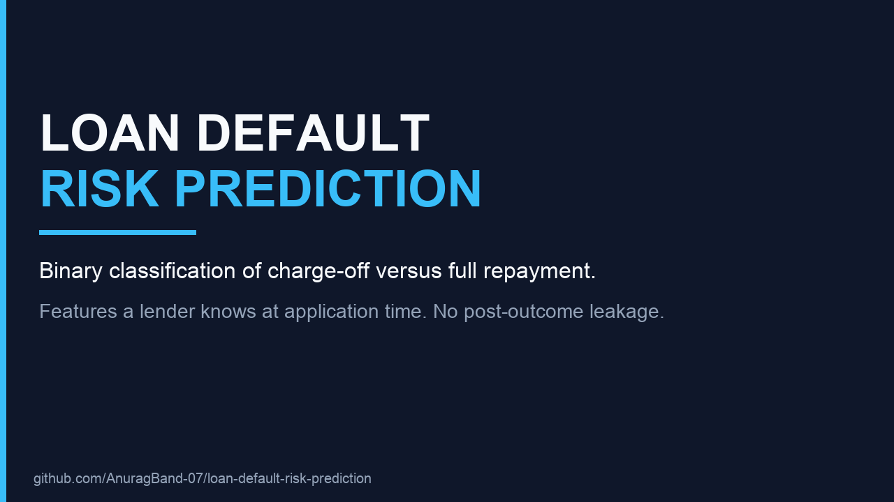

# Loan Default Risk Prediction

Predict whether a Lending Club borrower will **charge off** or **fully repay**, using only information known at application time.

[](demo/loan-default-demo.mp4)

**Demo video (1 min 36 sec):** [loan-default-demo.mp4](demo/loan-default-demo.mp4)

Playable page:

`https://github.com/AnuragBand-07/loan-default-risk-prediction/blob/main/demo/loan-default-demo.mp4`

Direct file:

`https://raw.githubusercontent.com/AnuragBand-07/loan-default-risk-prediction/main/demo/loan-default-demo.mp4`

## Problem

Lending outcomes are imbalanced: in this run, **87.5%** of finished loans are fully paid and **12.5%** default. A model that always predicts “repaid” is about 87% accurate and catches no defaulters.

The raw Lending Club extract has 150+ columns. Many of them (`recoveries`, `total_pymnt`, `last_pymnt_amnt`) exist only after the outcome is known. Training on those columns leaks the label and produces a score that collapses in production. This project keeps the columns a lender knows when the application is decided.

## Approach

`Load → clean and drop leakage → label finished loans → engineer features → preprocess → compare 6 models → tune XGBoost → choose a recall-weighted threshold`

- **Target.** `Fully Paid` = 0. `Charged Off` and `Default` = 1. Ongoing statuses (`Current`, `Late`, `In Grace Period`) are dropped because the outcome is still unknown.
- **Features.** About 30 application-time fields, plus 17 engineered signals. The main ratios are loan-to-income, installment-to-income, and revolving-balance-to-income. Loan grade is encoded as an ordinal A→G.
- **Models.** Logistic regression, KNN, RBF SVM, decision tree, random forest, and XGBoost. Each candidate is tuned with stratified 5-fold `GridSearchCV` scored on ROC-AUC. The bake-off uses a 30,000-row stratified sample so SVM and KNN stay tractable.
- **Imbalance.** SMOTE is applied inside the comparison pipelines, on training folds only. The final XGBoost model uses `scale_pos_weight` (negatives / positives ≈ 7.0).
- **Threshold.** The operating point maximizes F2, which weights recall twice as heavily as precision, because a missed defaulter costs more than a false alarm.

## Results

Measured on the checked-in run: **52,778** finished loans, stratified 80/20 split, test set of **10,556** loans.

| Model | 5-fold CV ROC-AUC |
|---|---:|
| Logistic regression | 0.643 |
| XGBoost | 0.633 |
| Random forest | 0.620 |
| Decision tree | 0.602 |
| KNN | 0.564 |
| SVM | 0.559 |

| Final XGBoost (full training set) | Value |
|---|---|
| Best CV ROC-AUC | 0.629 |
| **Test ROC-AUC** | **0.621** |
| Baseline threshold 0.50 | default recall 0.482, precision 0.183 |
| **F2 threshold 0.28** | **default recall 0.948, precision 0.132** |

At the chosen threshold the model flags **1,249 of 1,318** test defaults. Grade, recent delinquencies, and loan-to-income are the strongest drivers.

Logistic regression leads the small-sample bake-off. XGBoost is tuned as the final model because class weighting is built in and it captures non-linear interactions among the application features.

## Tech stack

Python, pandas, scikit-learn, XGBoost, imbalanced-learn, matplotlib, seaborn.

## Run it

```bash
python -m venv .venv
source .venv/bin/activate
pip install -r requirements.txt
python make_synthetic_smoketest.py
jupyter notebook loan_default_prediction.ipynb
```

`make_synthetic_smoketest.py` writes `data/accepted_2007_to_2018Q4.csv`, a Lending-Club-shaped file used so the notebook runs without the Kaggle download. To train on the real history, replace that CSV with the [Lending Club accepted loans 2007–2018](https://www.kaggle.com/datasets/wordsforthewise/lending-club) file. The notebook already selects the application-time columns.

The fitted pipeline and the chosen threshold are saved as `loan_default_model.joblib`.

## Repository layout

| Path | What it is |
|---|---|
| `loan_default_prediction.ipynb` | Full analysis, with executed outputs |
| `make_synthetic_smoketest.py` | Builds the reproducible input file |
| `loan_default_model.joblib` | Preprocessing, XGBoost model, and threshold |
| `demo/loan-default-demo.mp4` | Project walkthrough |
| `requirements.txt` | Pinned environment used to produce the notebook |
